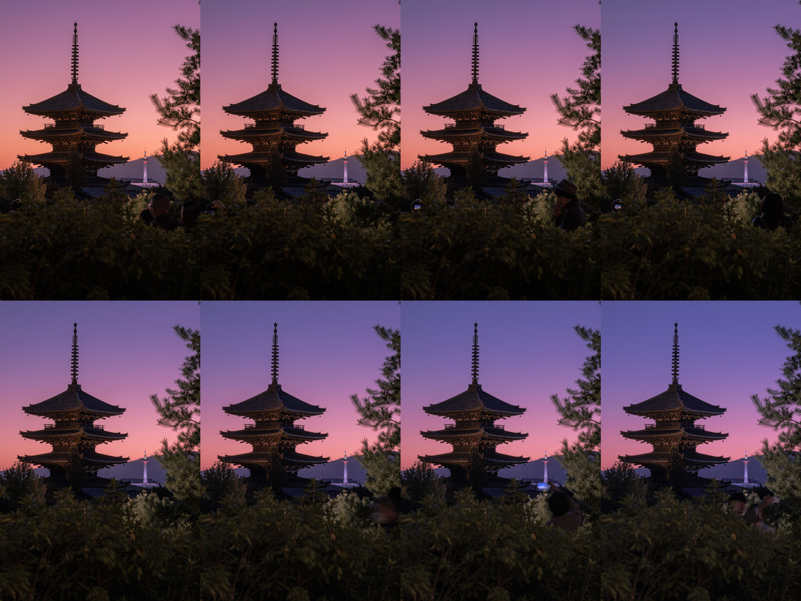

# Lightroom Edit Interpolator



This tool interpolates the `.xmp` files generated by Lightroom to have
"in-between" edits. Ideal for timelapses.

## How to use

1. Edit the first and last photo of your timelapse or series of photos.
2. Copy the first edit settings to all the photos except the last one, this is
   to make sure that not interpolable values are also set, for example "Film
   Simulation" for fujifilm.
3. Export your photos from lightroom as "original + settings" that should save
   your raw files alongside with your settings.
4. Save a backup of your photos, this script will make its own backup to `/bak`,
   but photos are valuable and better to be safe.
5. Run the script

```
cd folder_with_all_xmp
npx lightroom-interpolator .
```

6. Import your photos again, you might need to delete the original ones.

It reads all the `.xmp` files on the folder, finds the first and last one by
ordering them by name, and interpolates all the rest. It saves a copy of every
`.xmp` to a new `./bak` folder.

## How it works

The scripts find "interpolable" values on the `.xmp` file, those values are
defined on the `./interpolator-settings.json` file.

Here is an excerpt of an `.xmp` file.

```
crs:SaturationAdjustmentRed="+11"
crs:SaturationAdjustmentOrange="+9"
crs:SaturationAdjustmentYellow="+11"
crs:SaturationAdjustmentGreen="+42"
crs:SaturationAdjustmentAqua="0"
crs:SaturationAdjustmentBlue="+29"
crs:SaturationAdjustmentPurple="+35"
crs:SaturationAdjustmentMagenta="+24"
```

Then saves the values from the first and last `.xmp` files, and writes all of
them depending on their position on the list of files sorted by name.
